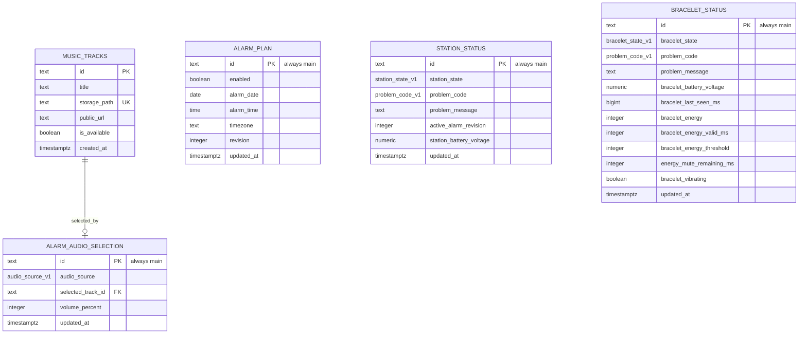

# Supabase v1 schema

`v1_schema.sql` is the concrete database contract for the personal wake-up prototype.

Apply it in the Supabase SQL editor or through the Supabase CLI against the target project. It creates:

- `alarm_plan`
- `alarm_audio_selection`
- `music_tracks`
- `station_status`
- `bracelet_status`
- storage bucket `wake-up-music`
- prototype-only anon read/write policies

The anon policies are intentionally permissive for the no-auth v1 prototype. They are not production-ready security.

## V1 table split

The schema intentionally keeps one active `main` row per responsibility:

- `alarm_plan`: whether and when the next alarm should happen.
- `alarm_audio_selection`: what the next alarm should play and at what volume.
- `music_tracks`: uploaded wake-up sounds.
- `station_status`: station state and station-side problem reporting.
- `bracelet_status`: latest bracelet state, energy window, vibration state, and battery voltage as seen and published by the station.

This split favors readability over the smallest possible number of Supabase reads. The station should load `alarm_plan` and `alarm_audio_selection` together, then cache the last valid combined configuration locally.
Bracelet energy remains station-side alarm input; the station does not stream energy to Supabase at bracelet telemetry rate.

This file is the current v1 schema, not a reversible migration. If an older prototype database already contains `alarm_config` or `device_status`, migrate or drop those old tables manually after preserving any data you still need.

## Mermaid overview

