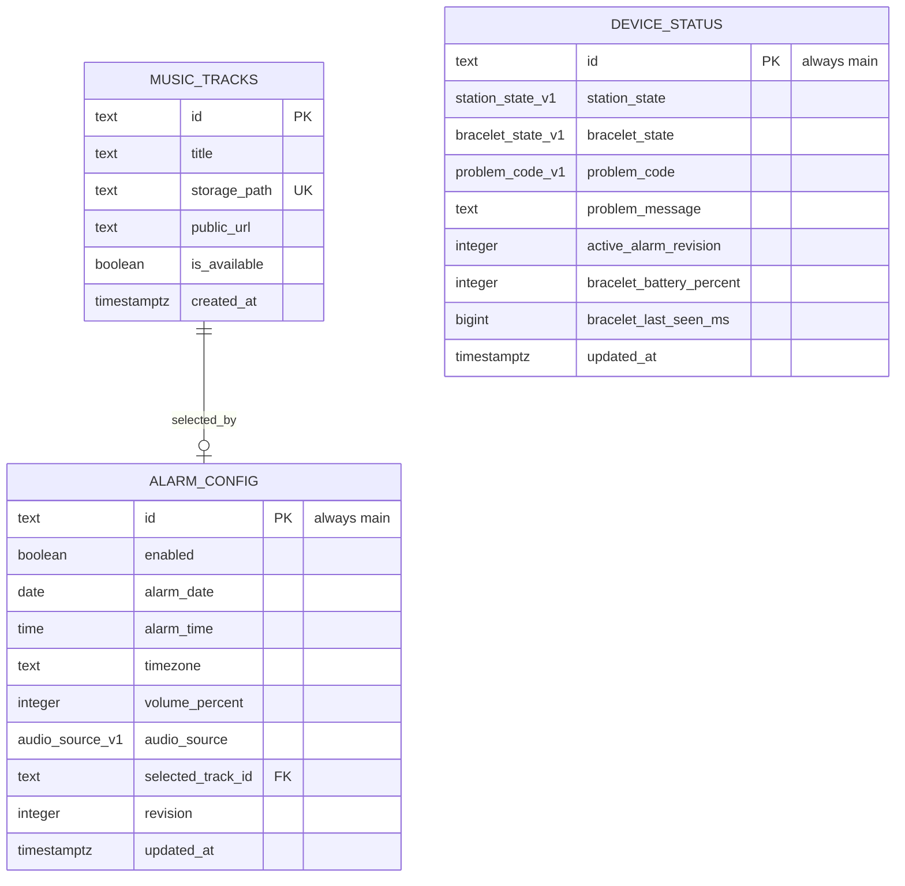

# Supabase v1 schema

`v1_schema.sql` is the concrete database contract for the personal wake-up prototype.

Apply it in the Supabase SQL editor or through the Supabase CLI against the target project. It creates:

- `alarm_config`
- `music_tracks`
- `device_status`
- storage bucket `wake-up-music`
- prototype-only anon read/write policies

The anon policies are intentionally permissive for the no-auth v1 prototype. They are not production-ready security.

## V1 table split

The schema intentionally keeps one active `alarm_config` row instead of splitting alarm time, audio choice, and volume into separate tables. For v1 the station only needs one next-alarm contract to fetch and cache, so extra tables would add joins and synchronization rules without adding useful behavior.

## Mermaid overview

